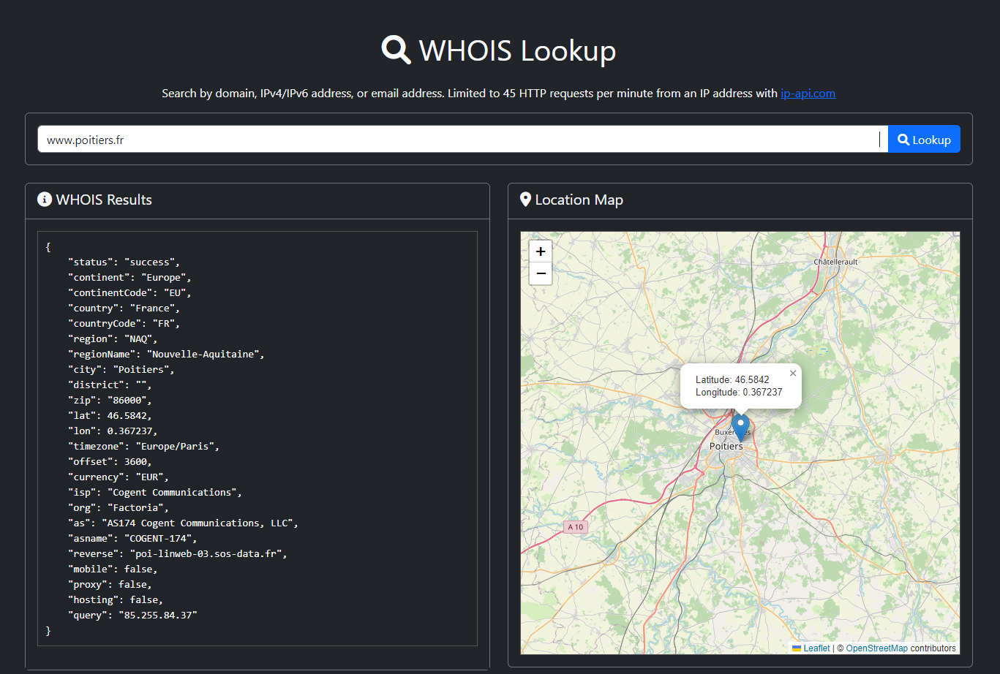
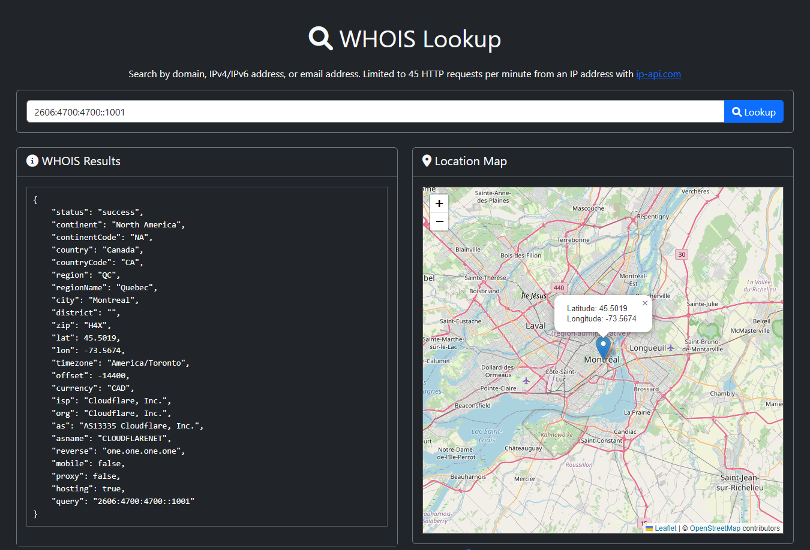

# WHOIS Lookup

- A simple but efficient WHOIS Lookup app, for domains, IPv4/IPv6, or email address based on ip-api.com.

## Fonctionnalities
- Search by domain
- IPv4 or IPv6 address
- email address
- Leave empty for your own Whois lookup

## Technologies
- **ip-api.com** : API JSON - https://ip-api.com/docs/api:json
- **Leaflet 1.9.4** : Display interactive map - https://leafletjs.com/reference.html
- **PHP 8.2**
- **Bootstrap 5.3.3**
- **Font Awesome 6.0.0**

## Domain lookup : 

## IPV6 lookup : 

